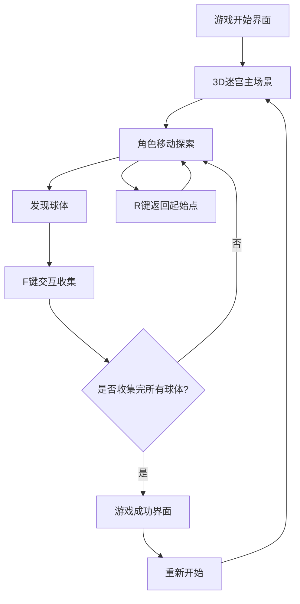

# 3D迷宫球体收集游戏产品需求文档

## 1. 产品概述
一款基于Three.js的3D第三人称视角迷宫探索游戏，玩家从起始点出发，在紫色虚空风格的迷宫中收集随机颜色的球体。
游戏采用现代Web技术栈，提供流畅的3D游戏体验和直观的操作界面，目标是为玩家提供具有挑战性和趣味性的迷宫探索体验。

## 2. 核心功能

### 2.1 用户角色
本游戏为单人游戏，无需用户注册系统。

### 2.2 功能模块
游戏需求包含以下主要页面：
1. **游戏主界面**：3D迷宫场景、角色控制、球体交互系统
2. **游戏开始界面**：科技感启动提示、游戏说明
3. **游戏结束界面**：成功提示、重新开始选项

### 2.3 页面详情

| 页面名称 | 模块名称 | 功能描述 |
|----------|----------|----------|
| 游戏开始界面 | 启动提示 | 显示科技感的游戏开始提示，包含操作说明和开始按钮 |
| 游戏主界面 | 3D迷宫场景 | 渲染紫色虚空材质的迷宫墙体，第三人称视角显示角色和环境 |
| 游戏主界面 | 角色控制系统 | WASD键控制角色移动，R键返回起始点，流畅的第三人称视角跟随 |
| 游戏主界面 | 球体交互系统 | F键与球体交互，随机生成单一颜色的4个球体，交互后球体消失 |
| 游戏主界面 | 小地图显示 | 右上角显示迷宫俯视图，标记角色位置、球体位置和起始点 |
| 游戏主界面 | 游戏状态管理 | 追踪收集进度，检测游戏完成条件，管理球体随机生成逻辑 |
| 游戏结束界面 | 成功提示 | 收集完所有球体后显示成功信息和重新开始选项 |

## 3. 核心流程

**主要游戏流程：**
1. 玩家进入游戏，看到科技感的开始界面
2. 点击开始后进入3D迷宫场景，角色出现在起始点
3. 系统随机选择一种颜色（蓝/黄/红/绿），在对应位置生成4个该颜色的球体
4. 玩家使用WASD键控制角色在迷宫中移动，通过小地图导航
5. 接近球体时按F键进行交互，球体被收集并消失
6. 收集完所有4个球体后，游戏显示成功提示
7. 玩家可选择重新开始游戏，系统重新随机生成球体颜色和位置

## 4. 用户界面设计

### 4.1 设计风格
- **主色调**：紫色系（#6B46C1, #8B5CF6）配合深色背景（#1F2937）
- **次要色彩**：球体颜色（蓝色#3B82F6、黄色#F59E0B、红色#EF4444、绿色#10B981）
- **按钮样式**：科技感圆角按钮，带发光效果和悬停动画
- **字体**：现代无衬线字体，主要文字16px，标题24px
- **布局风格**：沉浸式3D场景，UI元素采用半透明卡片式设计
- **图标风格**：简约线性图标，配合科技感元素

### 4.2 页面设计概览

| 页面名称 | 模块名称 | UI元素 |
|----------|----------|--------|
| 游戏开始界面 | 启动提示 | 居中科技感标题，渐变背景，发光开始按钮，操作说明文字 |
| 游戏主界面 | 3D场景 | 全屏3D渲染区域，紫色虚空材质墙体，平滑光照效果 |
| 游戏主界面 | 小地图 | 右上角150x150px半透明地图，白色迷宫轮廓，彩色标记点 |
| 游戏主界面 | 控制提示 | 左下角半透明控制说明面板，简洁图标+文字说明 |
| 游戏结束界面 | 成功提示 | 居中成功动画，彩色文字，重新开始按钮 |

### 4.3 响应式设计
游戏主要面向桌面端设计，支持1920x1080及以上分辨率，确保3D场景和小地图在不同屏幕尺寸下的最佳显示效果。