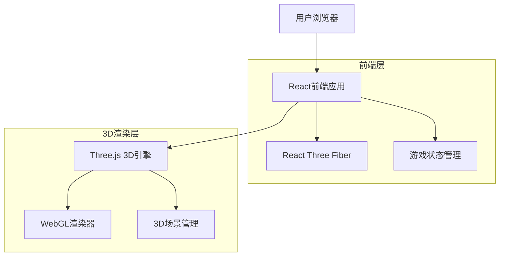
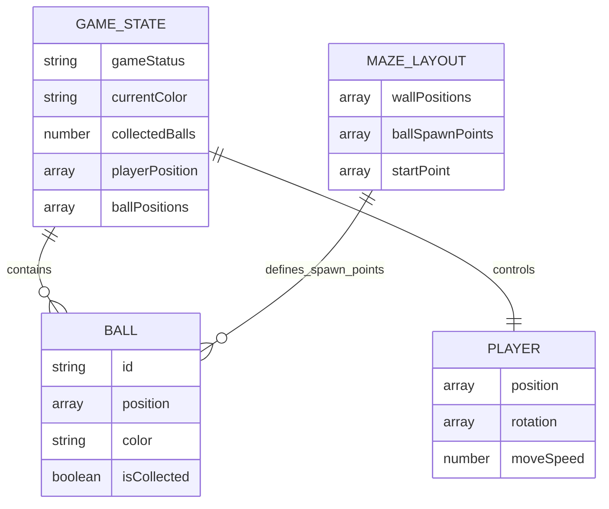

# 3D迷宫球体收集游戏技术架构文档

## 1. 架构设计



## 2. 技术描述

* **前端框架**：React\@18 + TypeScript + Vite

* **3D引擎**：Three.js\@0.158 + React Three Fiber\@8.15

* **样式方案**：Tailwind CSS\@3.3

* **状态管理**：Zustand\@4.4（轻量级状态管理）

* **构建工具**：Vite\@5.0（快速开发和构建）

* **辅助库**：@react-three/drei（Three.js辅助组件）

## 3. 路由定义

| 路由 | 用途                          |
| -- | --------------------------- |
| /  | 游戏主页面，包含开始界面、游戏场景和结束界面的状态切换 |

## 4. 组件架构

### 4.1 核心组件结构

```typescript
// 游戏主组件
interface GameState {
  gameStatus: 'start' | 'playing' | 'success'
  currentColor: 'blue' | 'yellow' | 'red' | 'green'
  collectedBalls: number
  playerPosition: [number, number, number]
  ballPositions: Array<{id: string, position: [number, number, number], collected: boolean}>
}

// 玩家控制组件
interface PlayerController {
  position: [number, number, number]
  rotation: [number, number, number]
  moveSpeed: number
  onMove: (direction: 'w' | 'a' | 's' | 'd') => void
  onInteract: () => void
  onReset: () => void
}

// 迷宫组件
interface MazeProps {
  wallPositions: Array<{position: [number, number, number], size: [number, number, number]}>
  material: 'void-purple'
}

// 球体组件
interface BallProps {
  id: string
  position: [number, number, number]
  color: string
  isCollected: boolean
  onCollect: (id: string) => void
}

// 小地图组件
interface MinimapProps {
  playerPosition: [number, number]
  ballPositions: Array<{position: [number, number], collected: boolean}>
  mazeLayout: number[][]
}
```

### 4.2 游戏逻辑API

**游戏状态管理**

```typescript
// 游戏初始化
function initializeGame(): GameState

// 随机生成球体
function generateRandomBalls(color: string): BallPosition[]

// 球体交互
function collectBall(ballId: string): boolean

// 检查游戏完成
function checkGameComplete(collectedCount: number): boolean

// 重置玩家位置
function resetPlayerPosition(): [number, number, number]
```

**输入控制API**

```typescript
// 键盘输入处理
interface KeyboardControls {
  keys: {
    w: boolean
    a: boolean
    s: boolean
    d: boolean
    f: boolean
    r: boolean
  }
  onKeyDown: (key: string) => void
  onKeyUp: (key: string) => void
}

// 玩家移动
function updatePlayerPosition(
  currentPosition: [number, number, number],
  direction: string,
  deltaTime: number
): [number, number, number]
```

## 5. 数据模型

### 5.1 数据模型定义



### 5.2 游戏配置数据

```typescript
// 迷宫布局配置（基于提供的图片）
const MAZE_CONFIG = {
  // 墙体位置（基于网格坐标）
  walls: [
    // 外墙
    {position: [0, 0, -10], size: [20, 2, 1]}, // 上墙
    {position: [0, 0, 10], size: [20, 2, 1]},  // 下墙
    {position: [-10, 0, 0], size: [1, 2, 20]}, // 左墙
    {position: [10, 0, 0], size: [1, 2, 20]},  // 右墙
    // 内部墙体（根据迷宫图片布局）
    // ... 更多墙体位置
  ],
  
  // 球体生成点（对应图片中的彩色点位置）
  ballSpawnPoints: {
    blue: [
      [-8, 0, -8], [-2, 0, -6], [6, 0, 2], [8, 0, -8]
    ],
    yellow: [
      [-6, 0, -8], [-4, 0, 6], [2, 0, -2], [4, 0, 8]
    ],
    red: [
      [-8, 0, -2], [-6, 0, 4], [-4, 0, 4], [8, 0, 6]
    ],
    green: [
      [-8, 0, 8], [-6, 0, 8], [4, 0, -6], [6, 0, 8]
    ]
  },
  
  // 起始点
  startPoint: [0, 0, 0],
  
  // 游戏设置
  settings: {
    playerMoveSpeed: 5,
    cameraFollowDistance: 8,
    ballInteractionDistance: 2,
    ballColors: ['blue', 'yellow', 'red', 'green']
  }
};

// 材质配置
const MATERIALS = {
  voidPurple: {
    color: '#6B46C1',
    transparent: true,
    opacity: 0.8,
    emissive: '#4C1D95',
    emissiveIntensity: 0.2
  },
  ballColors: {
    blue: '#3B82F6',
    yellow: '#F59E0B', 
    red: '#EF4444',
    green: '#10B981'
  }
};
```

